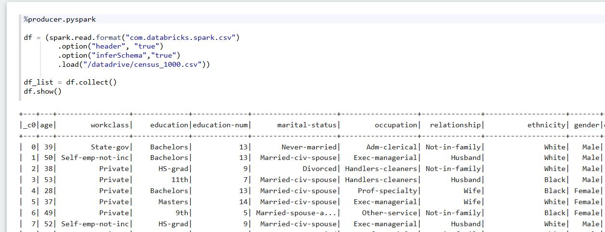
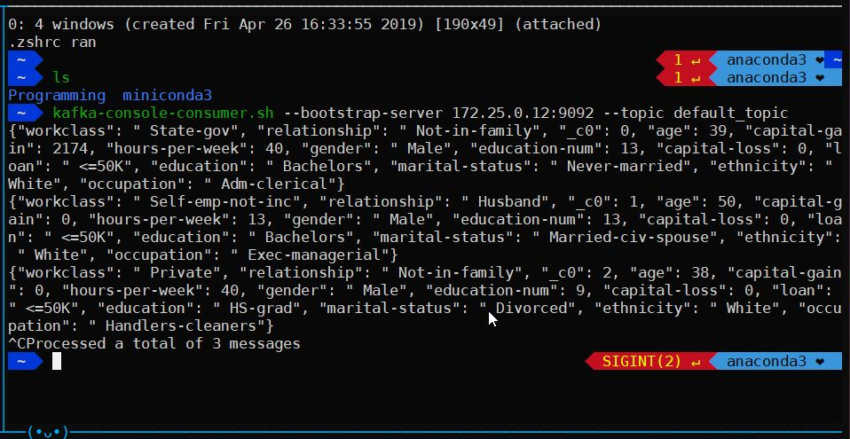
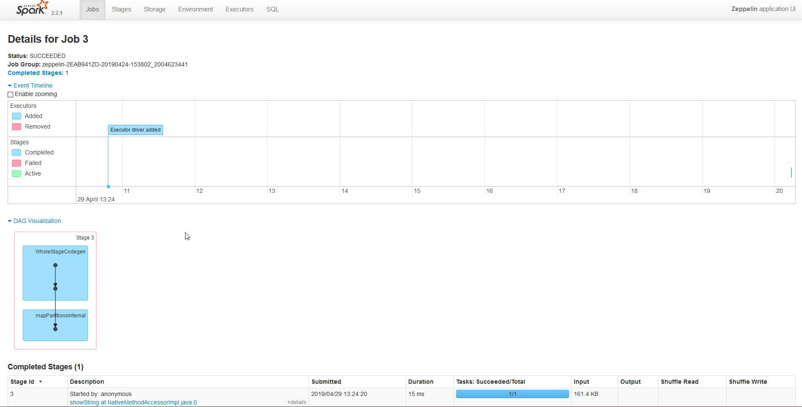
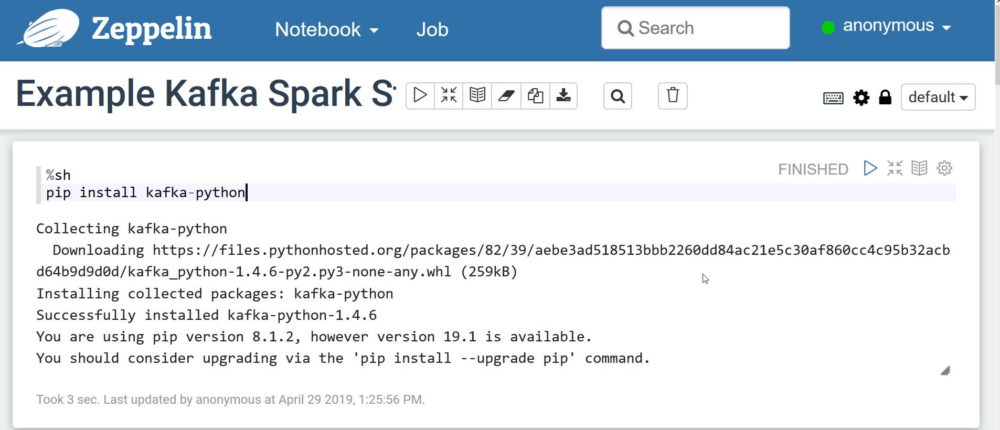
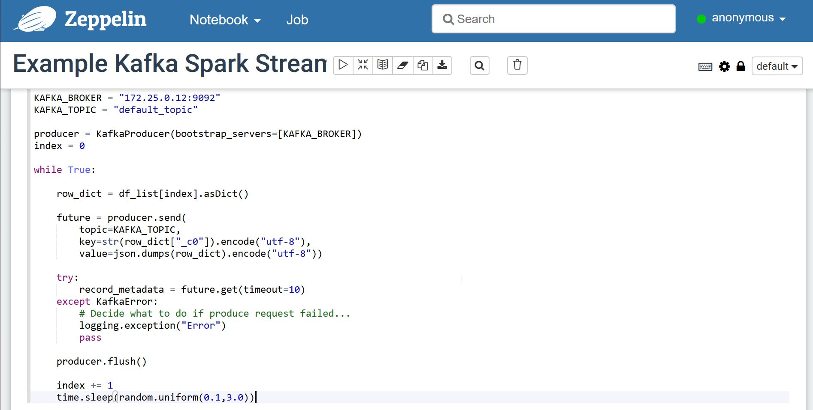
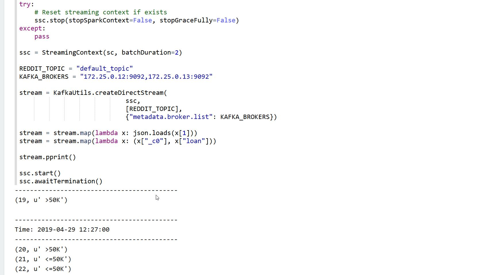
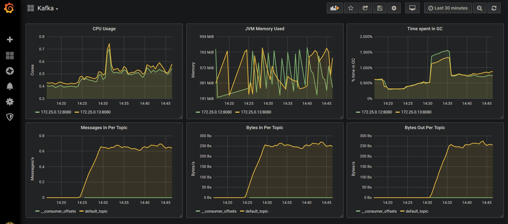

# Kafka Spark Streaming Full Stack

<table>
<tr>
<td style="width: 50%">

</td>
<td>

</td>
</tr>
<td style="width: 50%">

</td>
<td style="width: 50%">

</td>
</table>

This repository contains a docker-compose stack with Kafka and Spark Streaming, together with monitoring with Kafka Manager and a Grafana Dashboard.

| | |
|-|-|
| Kafka | Two kafka brokers managed by one zookeeper |
| Spark Streaming | Zeppelin client with multiple spark interpreters |
| Monitoring | Kafka manager client to visualise topics |
| Metrics | Grafana dashboard with prometheus using JMX metrics |

## Details

| Container | Image | Tag | Accessible | 
|-|-|-|-|
| zookeeper | wurstmeister/zookeeper | latest | 172.25.0.11:2181 |
| kafka1 | wurstmeister/kafka | 2.12-2.2.0 | 172.25.0.12:9092 (port 8080 for JMX metrics) |
| kafka1 | wurstmeister/kafka | 2.12-2.2.0 | 172.25.0.13:9092 (port 8080 for JMX metrics) |
| kafka_manager | hlebalbau/kafka_manager | 1.3.3.18 | 172.25.0.14:9000 |
| prometheus | prom/prometheus | v2.8.1 | 172.25.0.15:9000 |
| grafana | grafana/grafana | 6.1.1 | 172.25.0.16:3000 |
| zeppelin | apache/zeppelin | 0.8.1 | 172.25.0.19:8080 |


# Overview 

This repository contains a docker-file together with the configuration files to spin off all the services mentioned below. 

This docker-compose uses a network bridge to explicitly allocate IP addressses to all the services. This allows you to access all the services directly through their respective static IPs, which is handy if you want to use the kafka scripts (e.g. kafka-topics.sh) from your host server.

# Quickstart

The easiest way to understand the setup is by diving into it and interacting with it.

## Running Docker Compose

To run docker compose simply run the following command in the current folder:

```
docker-compose up -d
```

This will run deattached. If you want to see the logs, you can run:

```
docker-compose logs -f -t --tail=10
```

To see the memory and CPU usage (which comes in handy to ensure docker has enough memory) use:

```
docker stats
```

## Accessing the notebook

You can access the default notebook by going to http://172.25.0.19:8080/#/notebook/2EAB941ZD. Now we can start running the cells.

### 1) Setup

#### Install python-kafka dependency



### 2) Producer

We have an interpreter called %producer.pyspark that we'll be able to run in parallel.

#### Load our example dummy dataset

We have made available a 1000-row version of the [US Census adult income prediction dataset](https://www.kaggle.com/johnolafenwa/us-census-data).


#### Start the stream of rows

We now take one row at random, and send it using our python-kafka producer. The topic will be created automatically if it doesn't exist (given that `auto.create.topics.enable` is set to true).



### 3) Consumer

We now use the %consumer.pyspark interpreter to run our pyspark job in parallel to the producer.

#### Connect to the stream and print

Now we can run the spark stream job to connect to the topic and listen to data. The job will listen for windows of 2 seconds and will print the ID and "label" for all the rows within that window.



### 4) Monitor Kafka

We can now use the kafka manager to dive into the current kafka setup.

#### Setup Kafka Manager

To set up kafka manager we need to configure it. In order to do this, access http://172.25.0.14:9000/addCluster and fill up the following two fields:

* Cluster name: Kafka
* Zookeeper hosts: 172.25.0.11:2181

Optionally:
* You can tick the following;
    * Enable JMX Polling
    * Poll consumer information

#### Access the topic information

If your cluster was named "Kafka", then you can go to http://172.25.0.14:9000/clusters/Kafka/topics/default_topic, where you will be able to see the partition offsets. Given that the topic was created automatically, it will have only 1 partition.


#### Visualise metrics in Grafana

Finally, you can access the default kafka dashboard in Grafana (username is "admin" and password is "password") by going to 




